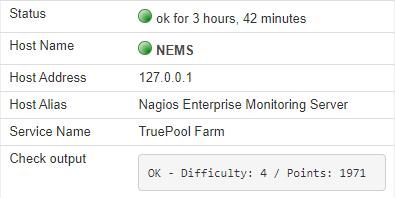

Check Command: check_truepool
=============================

+-------------------+
| |check_truepool|  |
+-------------------+

`TruePool.io <https://truepool.io/>`__ is a trusted Chia cryptocurrency farming
(mining) pool. This NEMS check command allows you to check your TruePool.io
farmer status to ensure your Chia farm is online and actively farming to the
pool.

Learn more about what makes TruePool.io unique in
`this video <https://www.youtube.com/watch?v=RFRGwBRAt7s>`__.

*check_truepool* expects just one argument (Launcher ID) and responds
accordingly. You can create multiple *check_truepool* advanced services to
check any number of Launcher IDs. For example, monitor your own and your
family member's farm status.

  NEMS Adagios output of check_truepool command
  
This check command requires NEMS Linux 1.6+.

Expected Responses
------------------

- ``OK`` - Farm is online and actively gaining points on Truepool.io
- ``CRITICAL`` - Either "Not found" (you provided an invalid Launcher ID) or
  "Farm Offline" (your farm has gained 0 points since the last check)

**Sample Output:** `OK - Points: 830 (24 hrs), 243 (this block) / Share: 0.0810% / Diff: 1`

.. admonition:: [Cache]
  :class: note
  
  If your *check_truepool* response includes `[Cache]` it means you are
  running the check command too frequently. Check your farm and determine approximately
  how long it takes you to solve a partial, then set your `check_truepool` to run
  with a cushion to allow variance. For example, if it takes you 60 seconds to solve
  a partial, you should not be running the check more frequently than every 3 minutes
  or so (if you need that level of monitoring). I'd say running every 10 minutes would be
  appropriate for most users.

Configuration
-------------

Obtain your Chia launcher ID. See `this truepool.io knowledgebase article
<https://truepool.io/kb/set-friendly-leaderboard-name>`__ for help with this.

**NEMS Configurator Setup**

- Add a new Advanced Service
- Give the service a name such as "TruePool (Robbie)"
- Give the service a description such as "Chia Farm - Robbie" - I identify my farmer since I monitor multiple farmers
- Set Check Period to `24/7`
- Set Notification Period to Work Hours (I don't need to be awoken if my farm goes down)
- Assign the advanced service to host `NEMS`
- Set max check attempts: `5`
- Set check interval: `10`
- Set retry interval: `10`
- Set first notification delay: `30`
- Set notification interval: `120`
- Set notification options: `w,u,c,r`
- Add your Launcher ID to the appropriate field
- Save, and generate your NEMS Config
