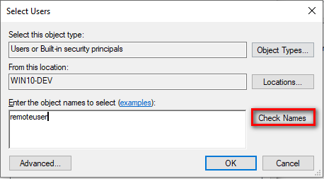

Monitor Windows Machines with Windows Management Instrumentation (WMI)
======================================================================

Introduction to WMI
-------------------

WMI is a set of specifications included in Microsoft Windows which
provides NEMS Linux with information about the status of Windows-based
hosts.

Disabled by default, WMI requires some configuration before NEMS Linux
can monitor the Windows host.

.. Warning:: Microsoft is making changes that will make agentless monitoring of Windows hosts impossible. Windows 10 version 2004 and newer has already broken WMI from Linux, and Windows Server is next. I am working hard to ensure WMIC is updated to accommodate these changes. Currently these instructions will work for Windows 10 devices but ONLY on the Virtual Applaince platform. Please watch for updates regarding other platforms.

Setting up WMI
--------------

**Configure WMI on the Windows end**

In order for the agent to have access to query WMI to collect  and
database metrics, the agent must have permission to access both DCOM and
WMI.

Verify that the Remote Registry, Server, and the Windows Management
Instrumentation services are running.

-  Click **Start**.
-  Click **Run**.
-  Type *services.msc* and press “Enter”. This will open the Services
   dialogue.
-  Scroll down to the *Remote Registry service*. Verify that the service
   is started and is set to **Automatic**.

.. figure:: ../../../img/wmi_windows_01.png
  :width: 600
  :align: center
  :alt: Remote Registry

By default even if the Remote Registry service is started Windows 7 and
later systems will deny remote access to the registry.

-  Scroll down to the *Server* service. Verify that the service is
   started and set to **Automatic**.

.. figure:: ../../../img/wmi_windows_02.png
  :width: 500
  :align: center
  :alt: Server

-  Scroll down to the *Windows Management Instrumentation* service.
   Verify that it too is started and set to **Automatic**.

.. figure:: ../../../img/wmi_windows_03.png
  :width: 500
  :align: center
  :alt: Windows Management Instrumentation

.. note:: **The best practice is to use a Local account on the monitored host as the agent  user.**

**Where this is not possible, use these procedures to grant permissions
for a remote user.**

-  All windows workstations must have a user with the same local user
   name and password.
-  Local user account on the target computer must have explicit DCOM and
   WMI namespace access rights granted specifically for remote
   connections.
-  User must also be a member of the *Performance Log Users* group   
-  Local security policies must be enabled for *Classic - local users
   authenticate as themselves*

**Grant minimal WMI permissions to the remote user**

This limits users other than those configured from remotely accessing
WMI.

.. note:: In the following example, replace "remoteuser" with the username of the user created on your Windows hosts.

On the monitored host machine

-  Right-click on **This PC**
-  Click **Manage**
-  Navigate to  *Services and Applications*  →  *WMI Control*

.. figure:: ../../../img/wmi_windows_04.png
  :width: 250
  :align: center
  :alt: WMI Control

-   Right-click **WMI Control** and click **Properties**
-   In the WMI Control Properties dialog box, click the **Security** tab.
-   Expand the Root node and select **CIMV2**, then click **Security**

.. figure:: ../../../img/wmi_windows_05.png
  :width: 350
  :align: center
  :alt: CIMV2

-  Select the user in the **Group or user names** box. If not listed select **Add**.

.. figure:: ../../../img/wmi_windows_06.png
  :width: 350
  :align: center
  :alt: Add User to CIMV2

-  Type in the user name and click **Check Names**

.. figure:: ../../../img/wmi_windows_07.png
  :width: 350
  :align: center
  :alt: Check Names

-  Click **OK** 

-  Grant the required permissions to the remote user by enabling the following check boxes in the Allow column:

1. Execute Methods
2. Enable Account
3. Remote Enable
4. Read Security

.. figure:: ../../../img/wmi_windows_08.png
  :width: 350
  :align: center
  :alt: Execute Methods and Enable Account

.. figure:: ../../../img/wmi_windows_09.png
  :width: 350
  :align: center
  :alt: Remote Enable and Read Security

While still in Computer Management

-  Expand **System Tools**
-  Expand **Local Users and Groups**
-  Click **Groups**
-  Right click **Performance Log Users**
-  Click **Add to Group**

.. figure:: ../../../img/PerfLogUsers.png
  :width: 550
  :align: center
  :alt: Performance Log Users Add to Group

-  Click **Add**

.. figure:: ../../../img/PerfLogUsersAdd.png
  :width: 350
  :align: center
  :alt: Click Add

-  Type in the username and click **Check Names**

-  Click **OK**
-  Click **Apply**
-  Click **OK** to close dialog box
-  Close **Computer Management** window  

**To grant DCOM permissions to a remote user**

-   On the monitored host machine, at the Windows Run prompt,
    type *DCOMCNFG* and press Enter.
-   In the Component Services dialog box that opens, navigate to
    *Component Services* → *Computers* → *My Computer*.
-   Right-click **My Computer** and click **Properties**.
-   Select the **Default Properties** tab.
-   To enable DCOM, select the **Enable Distributed COM on this
    computer** checkbox.
-   Click **Apply**.

.. figure:: ../../../img/wmi_windows_10.png
  :width: 350
  :align: center
  :alt: Enable Distributed COM

-   In the *My Computer* Properties dialog box, click the **COM Security** tab.
-   Under Access Permissions, click **Edit Limits**. 
-   In the Access Permission dialog box, add the user or group name
    necessary for the remote user.
-   Ensure Local Access and Remote Access are checked and click **OK**

.. figure:: ../../../img/wmi_windows_11.png
  :width: 500
  :align: center
  :alt: COM Security

-   In the Launch and Activation Permissions area, click **Edit Limits**.
-   In the Launch and Activation Permission dialog box, add the user or group name
    necessary for the remote user.
-   Grant the remote user all the permissions available in the Permissions
    for Administrators area by enabling all of the check boxes in the Allow
    column.

.. figure:: ../../../img/wmi_windows_12.png
  :width: 500
  :align: center
  :alt: Permissions

-   Click **OK** and/or **Yes** to close the dialog boxes.

**Enable Classic Security policies for Windows Systems that are not part
of a domain.**

-   Open the Control panel, and go to *Administrative Tools* → *Local
    Security Policy*.
-   The Local Security Settings window appears.
-   Go to *Local Policies* → *Security Options*.
-   Change the value of *Network access: Sharing and security model for
    local accounts.* to **Classic**.

.. figure:: ../../../img/wmi_windows_13.png
  :width: 600
  :align: center
  :alt: Security Options

**Open the Windows firewall for WMI traffic**

Enter the following in an Administrator Command Prompt:

.. code-block:: console

   netsh advfirewall firewall set rule group=”windows management
   instrumentation (wmi)” new enable=yes

**Add Your Windows User to NEMS SST**

Enter the username and password of the user created on the Windows
devices who was granted access to the WMI data.

.. figure:: ../../../img/nems_sst_windows_domain_credentials.png
  :width: 450
  :align: center
  :alt: SST Domain Credentials

Basic Configuration of Windows Devices In NEMS Linux Using WMI Check Commands
-----------------------------------------------------------------------------

**Adding check_win_xxxx Commands in Advanced Services**

1. In NEMS NConf click the *Add* button next to *Advanced Services*.
Then click the drop-down arrow in the *check command* select list, and
scroll down to the check_win\_\ *xxx* commands to choose the command you
wish to add.

.. figure:: ../../../img/nconf_add_advanced_service.png
  :width: 500
  :align: center
  :alt: Add advanced service

2. Configure the required fields and be sure to assign the Advanced
Service to your Windows host. Then click *Submit*. You will see your new
command in the list of available Advanced Services.

Repeat Steps 1 and 2 above as needed to add any further
check_win\_\ *xxx* services you require.

When complete these commands will now be available in the *Advanced
Services* list.

.. figure:: ../../../img/nconf_advanced_services_check_wmi.png
  :width: 500
  :align: center
  :alt: Advanced services list

Configure these Advanced Services as required to meet your needs and
assign them to one or multiple Windows devices.

Special Thanks to Bill Marshall
-------------------------------

This documentation would not be possible were it not for the effort of
Bill, also known as UltimateBugHunter-NitPicker on our Discord server.
Bill setup a test environment, tested, documented, and screen captured
the entire setup process and submitted it for inclusion in the official
docs. Thanks Bill!
