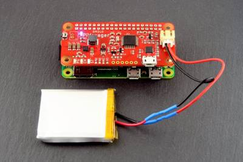

Omzlo PiVoyager Smart UPS and Watchdog for Raspberry Pi
=======================================================

The `Omzlo PiVoyager <https://cat5.tv/pivoyager>`__ is a pHat for
Raspberry Pi that allows programmable power events to take place, and
provides a smart battery backup UPS that keeps your NEMS Server powered
on even during a power outage.

NEMS Linux includes built-in support for the PiVoyager board. There is
no configuration needed: Simply plug it in and boot up your NEMS Linux
server.

Installation
------------

.. figure:: ../../img/std_pivoyager-pins.001.jpeg
  :width: 600
  :align: center
  :alt: PiVoyager Pin out

1.  Solder the 40-pin GPIO header to your PiVoyager if required.

2.  Safely power off your Raspberry Pi-powered NEMS Server.

3.  Disconnect the 5V power cord from your Raspberry Pi.

4.  Before mounting the PiVoyager atop your Raspberry Pi, power the
    PiVoyager with a USB cable. All LEDs, except the yellow one, should
    turn on.

5.  Connect the PiVoyager to your Raspberry Pi's GPIO.

6.  Connect the 5V power cord to your PiVoyager, *not* the Raspberry Pi
    (which will henceforward receive its power from the GPIO
    pins). *Never* connect power to both.

7.  If the Raspberry Pi does not immediately begin to power itself up,
    short-tap the power button on your PiVoyager

8.  Prepare a LiPo or Li-Ion battery that matches the following
    requirements:

    -  Has a nominal voltage of 3.7V and a charging voltage of 4.2V.
    -  Has built-in protection against over-heating, over-charge, and
       over-discharge.
    -  Accepts a charging current of 1000mA.
    -  Has a 2mm JST connector, or if you cannot find one, you can
       solder the battery leads to the two pin header.

     .. figure:: ../../img/std_pivoyager-conn-bat.jpg
       :width: 100
       :align: center
       :alt: PiVoyager Battery Connector

9.  Observe the polarity. There are + and - signs on the board that
    serve as polarity indicators. If your battery's polarity is
    incorrect, snip the leads and reverse them with some solder tinning
    and shrink tubing.

10. Connect your battery to the PiVoyager.

When both the battery and the USB power source are connected to the
PiVoyager, all four LEDs should be on.

The yellow LED will blink if the battery is charging and will be fully
on if the battery is fully charged.

Watchdog
--------

If your Raspberry Pi should become unresponsive or otherwise freeze up,
your NEMS server will automatically power cycle after 2 minutes.

Smart UPS
---------

If power is out and the battery becomes depleted (under 3.3V), your NEMS
Server will be safely shutdown, automatically. Upon power being
restored, the NEMS Server will boot, and the battery will begin
charging.

Battery Life
------------

On our NEMS Linux 1.5.2 Raspberry Pi 3 Model B+ with a 3,000 mAh
battery, we see around 5.5 hours of battery life before NEMS Linux is
safely shut down.

Check Commands
--------------

Check commands are coming to NEMS Linux 1.6 to monitor the state of your
PiVoyager's smart UPS.

Confirm Watchdog
----------------

To confirm your PiVoyager devices is detected and active, visit NEMS
Server Overview on your NEMS Dashboard.

To test if your piVoyager watchdog is working, stop the heartbeat and
wait 2 minutes:

.. code-block:: console

    sudo kill -9 $(cat /var/run/nems-pivoyager.pid)

This should not be done on a production server (it is akin to pulling
the power on a live system).
