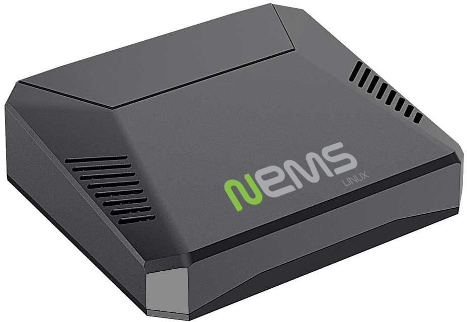

Argon ONE Raspberry Pi 4 Case
=============================

  Argon ONE Case for Raspberry Pi 4

The stylish aluminum alloy body, the combination of both passive and
active cooling, and a power button that safely controls the power state
of your NEMS Server are just a few of the points that make the Argon ONE
case a beautiful choice for your Raspberry Pi 4-based NEMS Server.

The Argon ONE active cooling fan is controlled via I2C, and the fan
speed varies based on how hot the Raspberry Pi SOC is. The power button
on the Argon ONE triggers a safe software shutdown on the Raspberry Pi,
as if you had typed *shutdown now -h*

Requirements
------------

-  Raspberry Pi 4 (Any Model)
-  NEMS Linux 1.6+

Where To Buy
------------

Please use one of the links in `the Category5 TV
Shop <https://category5.tv/shop/product/argon_one>`__ to support NEMS
Linux.

Power Button
------------

=========== ============== ======================
Powered Off Short Press    Power On
Powered On  Hold 3 Seconds Safe Shutdown
Powered On  Hold 5 Seconds Hard (Unsafe) Shutdown
Powered On  Double Tap     Hard (Unsafe) Reboot
Powered On  Short Press    Nothing Yet
=========== ============== ======================

Fan Controller
--------------

Defaults
~~~~~~~~

-  CPU temperature below 50°C, fan will be disabled.
-  CPU temperature between 50-55°C, fan will run at 5% speed.
-  CPU temperature between 55-60°C, fan will run at 10% speed.
-  CPU temperature between 60-65°C, fan will run at 30% speed.
-  CPU temperature between 65-70°C, fan will run at 55% speed.
-  CPU temperature between 70-75°C, fan will run at 75% speed.
-  CPU temperature between 75-80°C, fan will run at 85% speed.
-  CPU temperature between 80-85°C, fan will run at 90% speed.
-  CPU temperature above 85°C, fan will run at 100% speed.

You may adjust the fan speed settings in `NEMS
SST <https://docs.nemslinux.com/config/nems_sst>`__.

.. |image1| image:: https://docs.nemslinux.com/_media/hardware/argon_one.jpg?w=400&tok=197e8e
   :width: 4.1665in
   :height: 0.3929in
