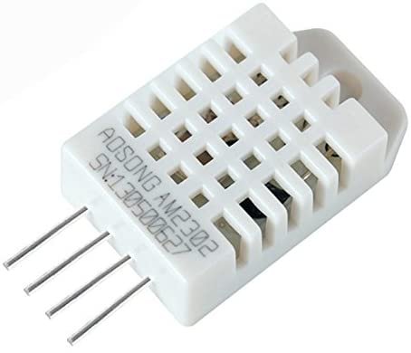
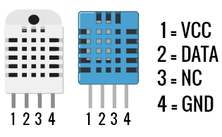

DHT Sensors
===========

Introduction
------------

DHT sensors are an ultra-affordable Arduino sensor, compatible with
various single board computers such as the Raspberry Pi. DHT sensors
contain a capacitive humidity sensor and a thermistor, plus a basic chip
to convert the analog data to digital and provide a digital signal with
the temperature and humidity to any compatible NEMS Linux server, such
as Raspberry Pi, ODROID or Pine64 NEMS Servers.

DHTxx support requires NEMS Linux 1.6+.

Compatible DHT Sensors
----------------------

DHT11
~~~~~

`Buy on Amazon.com <https://amzn.to/31RIjsf>`__

.. figure:: ../../img/dht11.jpg
  :width: 130
  :align: left
  :alt: DHT11 Sensor

The DHT11 sensor is reasonably accurate, but has a fairly narrow range,
making it only suitable for indoor use where it is known the room
temperature and humidity will not fall outside the available thresholds.

-  20-80% humidity readings with 5% accuracy
-  0-50°C temperature readings ±2°C accuracy

DHT22/AM2302
~~~~~~~~~~~~

`Buy on Amazon.com <https://amzn.to/3alpeCE>`__

The DHT22 (or AM2302 for the wired version) is more accurate, and has a
significantly wider range, making it suitable for measuring more extreme
temperatures and humidity. This can be useful if you wish to use NEMS
Linux to alert you should your pipes be at risk of freezing, or your
freezer compressor failing.

-  0-100% humidity readings with 2-5% accuracy
-  -40 to 80°C temperature readings ±0.5°C accuracy

Connection
----------

The pinout for the DHT11, DHT22 and AM2302 are the same, so no matter
which DHT sensor you choose, it is an identical process to making it
work with your NEMS Server.

Place a 10k resistor between Pin 1 and Pin 2, which will ensure reliable
data output from the sensor when it switches from input to output. If
you don't have a resistor handy, don't worry about it. It'll improve
reliability to have it, but won't hurt anything if you don't.

Raspberry Pi
~~~~~~~~~~~~

-  Raspberry Pi Pin 1 (3.3V) to DHTxx Pin 1.
-  Raspberry Pi Pin 7 (GPIO4, GPCLK0, T-Cobbler P04) to DHTxx Pin 2.
-  DHTxx Pin 3 does not get connected.
-  Raspberry Pi GND to DHTxx Pin 4.

ODROID-XU4
~~~~~~~~~~

Note that the ODROID-XU4 provides 1.8V or 5V. As there is no 3.3V and
the minimum voltage for this sensor is 3V, you will need to use the 5V
pin.

JSON Output
-----------

NEMS Linux can output JSON temperature and humidity data from the DHT11
and DHT22/AM2302 device.

.. code-block:: console

    nems-info [dht11|dht22]

Check Commands
--------------

NEMS Linux includes Robbie Ferguson's *check_dhtxx* to monitor the
temperature and humidity data provided by a DHT Sensor. You can specify
both minimum and maximum values for the check command.

*check_dhtxx* automatically detects the version of DHTxx sensor you are
using.

Both the temperature and humidity sensors are supported, and check
commands are included in NEMS NConf.

-  check_dhtxx_temp
-  check_dhtxx_hum

Both a low and high threshold is set in NEMS NConf, allowing the DHT
sensor to enter a warning or critical state whether the
temperature/humidity are either too high or too low.

Calibration
~~~~~~~~~~~

As of NEMS Linux 1.6, both the thermal sensor and humidity sensor can be
calibrated within NEMS SST to ensure the highest level of accuracy.