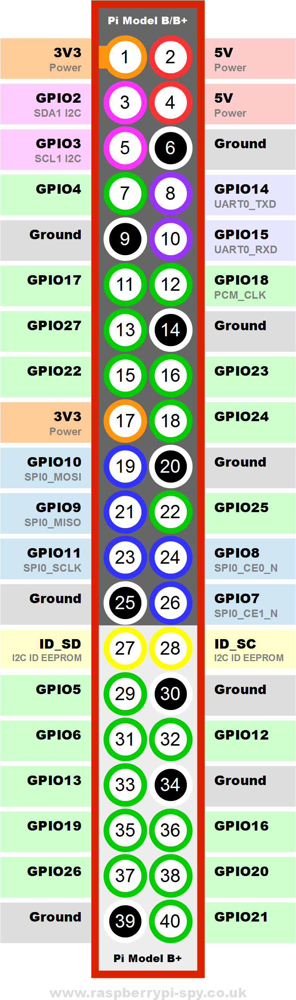

====================================== 
NEMS Linux: Raspberry Pi GPIO Pinout
======================================
 The pinout diagram is applicable to Raspberry Pi-based NEMS Linux servers, as well as `NEMS Tools GPIO Extender
 receivers <../nems-tools/gpioextender.html>`__.
                                                                                                       

======= ======================================= ======= =============================== 
**Pin** **Resrved For**                         **Pin** **Reserved For**                      
======= ======================================= ======= =============================== 
   1     Omzlo piWatcher / DHT Sensor              2     Omzlo piWatcher
   3     Omzlo piWatcher                           4     Omzlo piWatcher       
   5     Omzlo piWatcher                           6     Omzlo piWatcher
   7     DHT Sensor                                8     --
   9     DHT Sensor                                10    --
   11    --                                        12    --
   13    --                                        14    --
   15    --                                        16    --
   17    --                                        18    NEMS Warning Light - CRIT
   19    --                                        20    --
   21    --                                        22    --
   23    NEMS Warning Light - Unknown or WARN      24    NEMS Warning Light - OK
   24    --                                        26    --
   27    --                                        28    --
   29    --                                        30    --
   31    --                                        32    --
   33    --                                        34    --
   35    --                                        36    --
   37    --                                        38    --
   39    --                                        40    --
======= ======================================= ======= ===============================

********************
  Graphical Layout
********************

