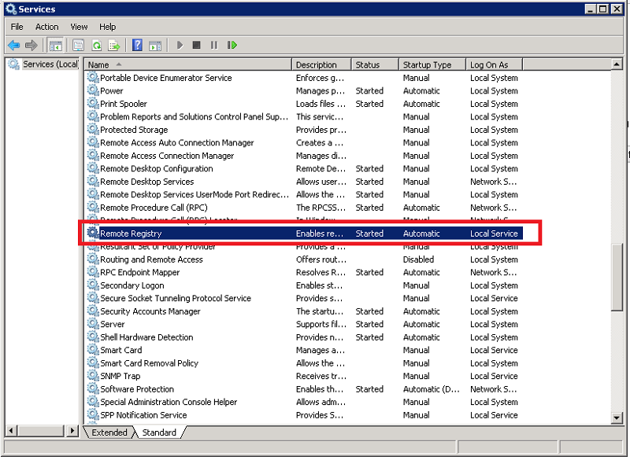
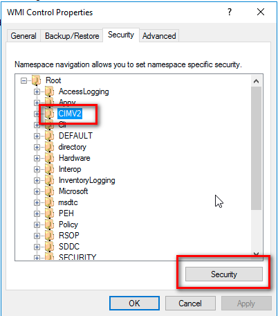
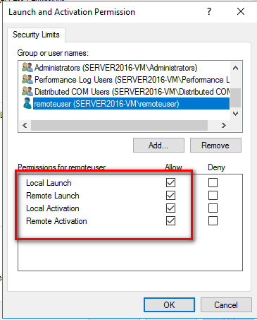
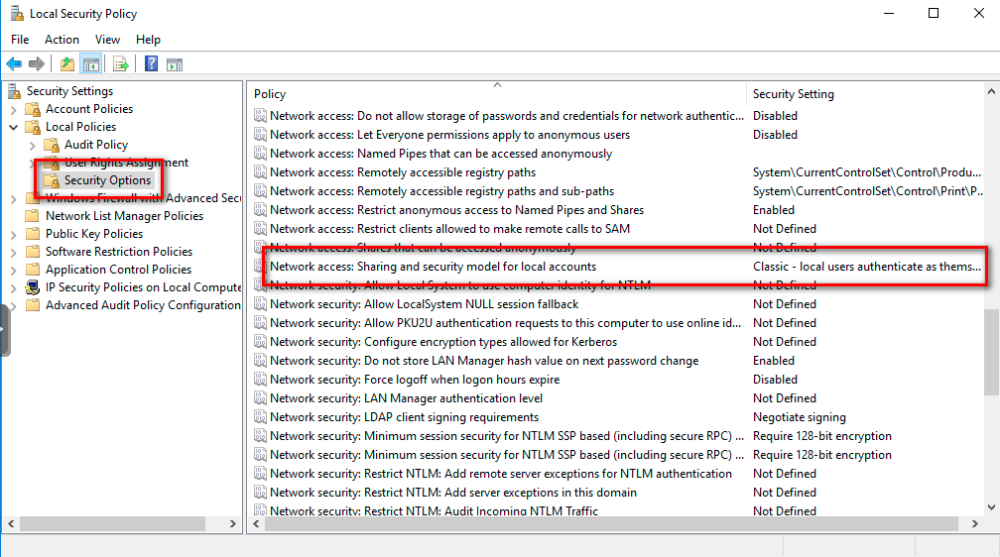
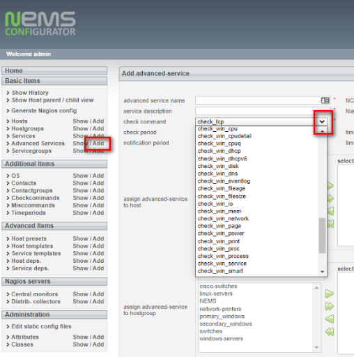

Monitor Windows Machines with Ping
==================================

The simplest type of check in NEMS Linux is to ping a host. The reply is
binary: Host is up when ping replies, host is down when ping does not
reply.

**Using a ping check is an excellent starting point for new NEMS Linux
users to become familiar with an easy-to-administer check command.**

To begin pinging a Windows host, simply add it to the windows-servers
group. The host check alive command will use check_ping to verify it as
online or offline.

Most software firewalls, including the Windows [Defender] Firewall,
block ping (ICMP) requests by default. So NEMS will think your host is
down unless you create a rule to allow ICMP echo requests and replies
through your Windows firewall.

Windows Defender Firewall
-------------------------

To enable ICMP response when using Windows Defender Firewall, simply run
the Command Prompt as Administrator and type the following:

IPv4 Networks:

netsh advfirewall firewall add rule name="ICMP Allow incoming V4 echo
request" protocol=icmpv4:8,any **dir**\ =in action=allow

IPv6 Networks:

netsh advfirewall firewall add rule name="ICMP Allow incoming V6 echo
request" protocol=icmpv6:8,any **dir**\ =in action=allow

Third Party Firewall
--------------------

If you are using a different firewall (eg., ESET Endpoint Security) you
will need to consult that software's documentation to allow ICMP echo
responses.

Here are some things to look for:

-  Many firewalls can exempt certain IP addresses or ranges from being
   blocked. This is often called a Trusted Zone, or whitelisted IP. You
   could add your NEMS Server as a trusted device. If you do this, make
   absolutely certain your NEMS Server is not accessible from the world
   (ie., do not port forward anything to NEMS Linux), and your NEMS user
   password is a strong one that only you know.
-  Most firewalls allow exemption of certain protocols or services. In
   those cases, you can simply enable/allow ping replies. It may be
   called “ping”, “incoming ping”, “ICMP Echo Reply”, or similar.

**DO NOT SIMPLY DISABLE YOUR FIREWALL.** Correctly establish a firewall
rule within your firewall application.

Monitor Windows Machines with Windows Management Instrumentation (WMI)
======================================================================

Introduction to WMI
-------------------

WMI is a set of specifications included in Microsoft Windows which
provides NEMS Linux with information about the status of Windows-based
hosts.

Disabled by default, WMI requires some configuration before NEMS Linux
can monitor the Windows host.

Setting up WMI
--------------

**Configure WMI on the Windows end**

In order for the agent to have access to query WMI to collect  and
database metrics, the agent must have permission to access both DCOM and
WMI.

Verify that the Remote Registry, Server, and the Windows Management
Instrumentation services are running.

-  Click **Start**.
-  Click **Run**.
-  Type *services.msc* and press “Enter”. This will open the Services
   dialogue.
-  Scroll down to the *Remote Registry service*. Verify that the service
   is started and is set to **Automatic**.

By default even if the Remote Registry service is started Windows 7 and
above systems will deny remote access to the registry.

-  Scroll down to the *Server* service. Verify that the service is
   started and set to **Automatic**.

.. figure:: ../../img/wmi_windows_02.png
  :width: 600
  :align: center
  :alt: Server

-  Scroll down to the *Windows Management Instrumentation* service.
   Verify that it too is started and set to **Automatic**.

.. figure:: ../../img/wmi_windows_03.png
  :width: 600
  :align: center
  :alt: Windows Management Instrumentation

**Grant minimal WMI permissions to the remote user**

This limits users other than those configured from remotely accessing
WMI.

**The best practice is to use a Local account on the monitored host as
the agent  user.**

**Where this is not possible, use these procedures to grant permissions
for a remote user.**

-  All windows workstations must have a user with the same local user
   name and password.
-  Local user account on the target computer must have explicit DCOM and
   WMI namespace access rights granted specifically for remote
   connections.
-  Local security policies must be enabled for “Classic - local users
   authenticate as themselves

On the monitored host machine, right-click on *My Computer*, and
navigate to Manage \| Services and Applications \| WMI Control.

.. figure:: ../../img/wmi_windows_04.png
  :width: 600
  :align: center
  :alt: WMI Control

1. Right-click WMI Control and click Properties.
2. In the WMI Control Properties dialog box, click the Security tab.
3. Expand the Root node and select CIMV2, then click Security.

Select the user in the *Group or user names* box. If not listed
select **Add**.

.. figure:: ../../img/wmi_windows_06.png
  :width: 600
  :align: center
  :alt: Add User to CIMV2

Type in the user name and click **Check Names**.

.. figure:: ../../img/wmi_windows_07.png
  :width: 600
  :align: center
  :alt: Check Names

Grant the required permissions to the remote user by enabling the
following check boxes in the Allow column:

1. Execute Methods
2. Enable Account
3. Remote Enable
4. Read Security

.. figure:: ../../img/wmi_windows_08.png
  :width: 600
  :align: center
  :alt: Execute Methods and Enable Account

.. figure:: ../../img/wmi_windows_09.png
  :width: 600
  :align: center
  :alt: Remote Enable and Read Security

**To grant DCOM permissions to a remote user**

This limits users other than those configured from remotely accessing
WMI.

1. On the monitored host machine, at the Windows Run prompt,
   type *DCOMCNFG* and press Enter.
2. In the Component Services dialog box that opens, navigate to
   Component Services \| Computers \| My Computer.
3. Right-click **My Computer** and click **Properties**.
4. Select the **Default Properties** tab.
5. To enable DCOM, select the *Enable Distributed COM on this
   computer* checkbox.
6. Click **Apply**.

.. figure:: ../../img/wmi_windows_10.png
  :width: 600
  :align: center
  :alt: Enable Distributed COM

1. In the My Computer Properties dialog box, click the COM Security tab.
2. Under Access Permissions, click Edit Limits. Give your chosen user
   Remote Access permission. (If user is not in the list of names follow
   steps above to add the user).
3. In the Launch and Activation Permissions area, click Edit Limits.
4. NOTE: In some cases, you also need to click the Edit Default and
   perform the succeeding steps.
5. In the Launch Permission dialog box, add the user or group name
   necessary for the remote user.

.. figure:: ../../img/wmi_windows_11.png
  :width: 600
  :align: center
  :alt: COM Security

Grant the remote user all the permissions available in the Permissions
for Administrators area by enabling all of the check boxes in the Allow
column.

Click **OK** and/or **Yes** to close the dialog boxes.

**Enable Classic Security policies for Windows Systems that are not part
of a domain.**

1. Open the Control panel, and go to *Administrative Tools* → *Local
   Security Policy*.
2. The Local Security Settings window appears.
3. Go to *Local Policies* → *Security Options*.
4. Change the value of *Network access: Sharing and security model for
   local accounts.* to **Classic**.

**Open the Windows firewall for WMI traffic**

Enter the following in an Administrator Command Prompt:

netsh advfirewall firewall **set** rule **group**\ =”windows management
instrumentation (wmi)” new enable=yes

**Add Your Windows User to NEMS SST**

Enter the username and password of the user created on the Windows
devices who was granted access to the WMI data.

.. figure:: ../../img/nems_sst_windows_domain_credentials.png
  :width: 600
  :align: center
  :alt: SST Domain Credentials

Basic Configuration of Windows Devices In NEMS Linux Using WMI Check Commands
-----------------------------------------------------------------------------

**Adding check_win_xxxx Commands in Advanced Services**

A) In NEMS NConf click the *Add* button next to *Advanced Services*.
Then click the drop-down arrow in the *check command* select list, and
scroll down to the check_win\_\ *xxx* commands to choose the command you
wish to add.

B) Configure the required fields and be sure to assign the Advanced
Service to your Windows host. Then click *Submit*. You will see your new
command in the list of available Advanced Services.

Repeat Steps A and B above as needed to add any further
check_win\_\ *xxx* services you require.

When complete these commands will now be available in the *Advanced
Services* list.

.. figure:: ../../img/nconf_advanced_services_check_wmi.png
  :width: 600
  :align: center
  :alt: Advanced services list

Configure these Advanced Services as required to meet your needs and
assign them to one or multiple Windows devices.

Monitor Windows Machines with NRPE
==================================

**Note:** NRPE is not the recommended way to monitor Windows hosts.
Please opt for WMI above. This is more for legacy versions of NEMS Linux
(ie., 1.0-1.3.x).

The Nagios Remote Plugin Executor (NRPE) allows your Nagios Enterprise
Monitoring Server to communicate with the Linux machines on your server
to determine things like free disk space, CPU load, and detect possible
issues that a simple ping can't determine.

As of NEMS 1.2 NSClient++ is optional for monitoring of Windows
computers (thanks to the addition of WMIC). If you’d like to use it,
please follow the directions below, otherwise use the provided
WMIC-based check commands.

1. Grab the latest Windows client at https://www.nsclient.org/download/

2. Install the client with the following settings:

   -  Select to install the “Generic mode” NSClient++.
   -  Choose “Complete installation” and if asked, choose to save config
      to ini file.
   -  Under “Allowed Hosts” it should read 127.0.0.1,\ *NEMSIP* (where
      NEMSIP is the IP address of your NEMS server)
   -  Clear the Password field for ease of deployment. NEMS sample
      scripts are setup to use NRPE without a password because I’m
      making the assumption that this is being deployed in a trusted .
      If you do not blank the password here, you will have to edit all
      the scripts before NEMS will be able to communicate with this
      computer.
   -  Enable all modules and change the NRPE mode to Legacy.
   -  Screen should look a little something like this: 

   .. figure:: ../../img/nsclient-setup.png
    :width: 600
    :align: center
    :alt: NSClient setup

   -  Add your Windows host to NEMS.

**Important Firewall Note**

If you have a software firewall running on your Windows machine, setup
an exception for your NEMS server IP to gain access through ports 5666
and 12489.

And there we have it! Your NEMS Server can now check your Windows
machine at a deeper level
using `check_nrpe <https://docs.nemslinux.com/check_commands/check_nrpe>`__.

Special Thanks
==============

Bill Marshall
-------------

This documentation would not be possible were it not for the effort of
Bill, also known as UltimateBugHunter-NitPicker on our Discord server.
Bill setup a test environment, tested, documented, and screen captured
the entire setup process and submitted it for inclusion in the official
docs. Thanks Bill!
