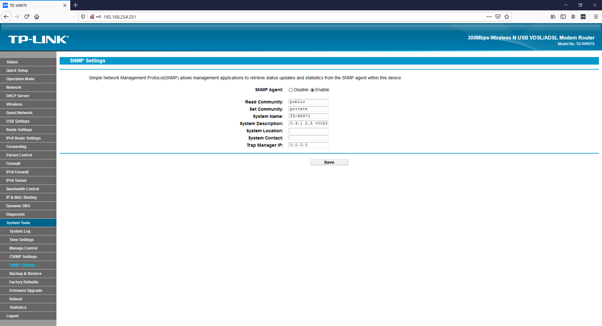
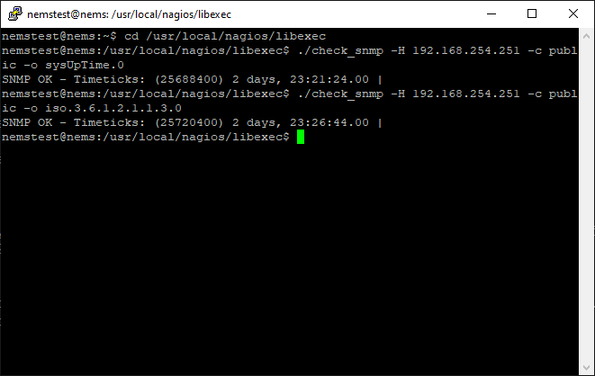

SNMP
====
The Simple Network Management Protocol (SNMP) allows you to collect and monitor information about your SNMP enabled device.  This protocol was created as a way to gather information from various systems and equipment in a uniform manner.

Basics
------

The SNMP hierarchy consists of multiple tables called Management Information Bases (MIBs).  MIBs can follow universal standards (i.e. RFC 1441-see links below for more information) or vendor defined.  Each MIB consists of one or more nodes which can represent an individual device or device component.  Each node has a unique Object Identifier (OID).  SNMP monitoring works by the monitoring host (in this case, NEMS) connects to the SNMP agent on the remote device.
Version.

There are currently three version of the SNMP protocol (1v, c2v, and 3v).  It is up to the device manufacturer which one is implemented.

**Community**

This is the security method SNMP.  The basic types of communities are read-only (normally public), read-write (defined in the deice configuration), and trap (also defined in configuration).  Each community has a name defined in the device configuration.

**Presteps**

Ensure that the device to be monitored is SNMP capable and SNMP is configured.

MIB/OID
-------

Vendor sites and community forums may provide the MIBs and OIDs, but there are ways of retrieving information from the device itself.

**Method 1 - MIB Browser**

There are several free MIB browsers available on the internet. Most provide a tree structure of the device.

.. figure:: ../../img/snmp_002.png
  :width: 600
  :align: center

**Method 2 - snmpwalk**

snmpwalk will connect to the remote device and retrieve a list of OIDs.  Open a NEMS ssh session.

The command format is 

.. code-block:: console

  snmpwalk -v *snmp version* -c *snmp community* *IP*

A list of OIDs will be returned.  Copy the results to a text document or spreadsheet for easy reference.

.. figure:: ../../img/snmp_003.png
  :width: 600
  :align: center

Testing with ./check_snmp
-------------------------

From the NEMS ssh session, navigate to /usr/local/nagios/libexec.  The command is check_snmp and the options are:

Usage:

.. code-block:: console

  check_snmp -H <ip_address> -o  [-w warn_range] [-c crit_range]
  [-C community] [-s string] [-r regex] [-R regexi] [-t timeout] [-e retries]
  [-l label] [-u units] [-p port-number] [-d delimiter] [-D output-delimiter]
  [-m miblist] [-P snmp version] [-N context] [-L seclevel] [-U secname]
  [-a authproto] [-A authpasswd] [-x privproto] [-X privpasswd] [-4|6]

In this example, uptime will be test using both the OID and Object name using the command format:

.. code-block:: console

  *./checksnmp -H remote ip -c SNMP community -o OID or Object*

In this example, System Uptime is check using both the OID and the Object name.  Note, the .0 is put on the end of sysUpTime, this denotes to collect child information and is required.

Both work and return the same information.  Depending on the device and which MIB it uses (standard or vendor) will dictate which one is used.

NEMS Check
----------

Follow these steps to configure a basic SNMP check.

- Launch NEMS Configurator (NConf)
- Click on Add for Advanced Services
- Enter most fields according to environment standards (i.e. name, description, check/notifications periods, etc)
- Select check_snmp in the check command field
- For ARG1 at the bottom of the screen, at the minimum, enter the community and object to check. *-c public -o iso.3.6.1.2.1.1.3.0*  You can add warnings *-w* and criticals *-c* if the appropriate
- Add new check to host
- Generate and deploy Nagios config

.. figure:: ../../img/snmp_005.png
  :width: 600
  :align: center

.. figure:: ../../img/snmp_006.png
  :width: 600
  :align: center

  Note the service parameters.

Launch Adagios and validate the check ran with no issues.

.. figure:: ../../img/snmp_007.png
  :width: 600
  :align: center

  Adagios shows our SNMP check is running perfectly.

Links
-----

- https://www.rfc-editor.org/
- http://www.oid-info.com/index.htm
- http://www.ireasoning.com/mibbrowser.shtml
- http://www.oidview.com/mibs/detail.html
