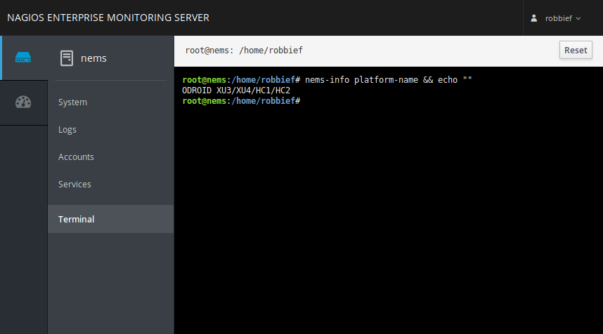

Cockpit
=======

NEMS Linux includes `Cockpit from Red Hat <https://access.redhat.com/documentation/en-us/red_hat_enterprise_linux/7/html-single/getting_started_with_cockpit/index>`__. In its NEMS implementation, Cockpit provides browser-based SSH access, some realtime performance graphs, and basic system administration tools such as the ability to reboot or safely shutdown your NEMS server.

  Cockpit allows terminal access and other system-level tools within a browser session.
  
Login to Cockpit
----------------

You'll find Cockpit in the System menu on NEMS Dashboard. To login, enter your NEMS Linux username and password.

**Seeing Disabled Features in Cockpit?**

When you first login to Cockpit, you will be running in Limited access mode. Simply click the button at the top of the Cockpit window to enable Administrative access:

Otherwise your level of access will match the non-elevated user and all features which require root access will be greyed out.
