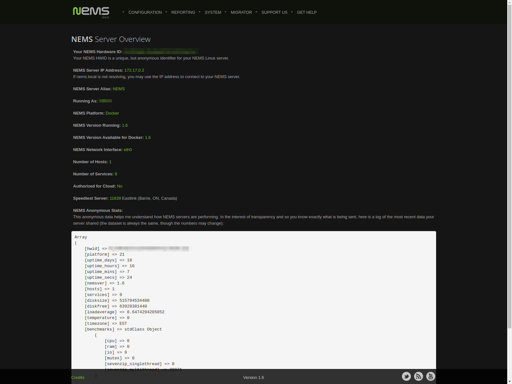

NEMS Server Overview
====================

NEMS Server Overview, found in the Configuration menu of NEMS Dashboard,
is an at-a-glance overview of some important information about your NEMS
Server.

On this screen, you can obtain your unique NEMS Hardware ID (HWID), IP
address, and other useful information about your running NEMS Server.

You may also review what anonymous data NEMS Linux shares with the NEMS
API.

  NEMS Server Overview screen circa NEMS Linux 1.6.
