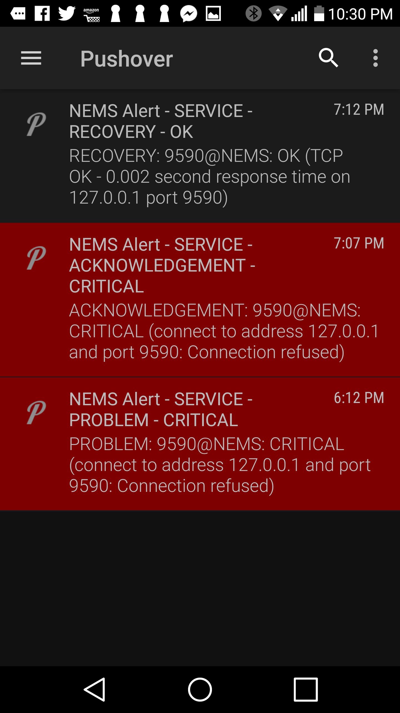

Check Command: check_tcp
========================

Service Parameters
------------------

NEMS Linux requires just one argument for the check_tcp check command:
the port number to check.

Quick Use
~~~~~~~~~

1. Open NEMS NConf.
2. Click Services→Add.
3. Give it a friendly name.
4. Choose the Check Command “check_tcp”.
5. Set the notification period to 24/7.
6. Set your intervals and notification settings as normal.
7. Set ARG1 to the port number. Eg., 8080
8. Hit submit.

Then go `generate your
config <https://builddocsforme.readthedocs.io/en/latest/basic/port9590.html>`__ and
if you set your intervals correctly, all should be a-okay. If not,
expand the error message to see where you went wrong.

Exercise
~~~~~~~~

NEMS Linux includes a dummy port listener running on port 9590. The port
listener is cleverly
called `9590 <https://docs.nemslinux.com/features/9590>`__, and does
nothing other than reply that it is up. This can be used to simulate a
port on another device.

Let's setup a service monitor on the NEMS host to warn us if port 9590
ever goes offline.

1.  On the left menu of NConf, you'll see “Services”. Click “Add”.
2.  Set the *Service Name* to: 9590
3.  Leave *Service Enabled* set to: Yes
4.  Set the *Check Command* to: check_tcp
5.  Set *Assigned to Host* to: NEMS (this host comes pre-installed)
6.  Leave *Check Period* set to: 24×7
7.  Set *Notification Period* to: 24/7
8.  Leave *Service Templates* as is, none selected.
9.  Under *Contact Groups* highlight the 'admins' group and press the
    arrow pointed right to move it to *Selected Items*.
10. Leave *Notes*, *Notes * and *Action * blank.
11. Set *Max Check Attempts* to: 5
12. Set *Check Interval* to: 30
13. Set *Retry Interval* to: 5
14. Set *First Notification Delay* to: 60
15. Set *Notification Interval* to: 90
16. Set *Notification Options* to: w,u,c,r,f,s
17. Leave *Active Checking*, *Passive Checking*, *Notification
    Enabled*, *Check Freshness* and *Freshness Threshold* blank.
18. Leave *Assign Service to servicegroup* as is, none selected.
19. Set *Params for check command* to the port number: 9590
20. Press *Submit*
21. `Generate Nagios
    Config <https://docs.nemslinux.com/config/nems_nconf/generate_nagios_config>`__

Once the new config is running, try failing the service by
opening `Monit Service
Manager <https://docs.nemslinux.com/features/monit>`__, click on the
Process named *9590*, and then click “Stop service”. You'll notice
within 30 minutes the status of 9590 will show as a problem in all
status views (Eg., NEMS TV Dashboard, NEMS Adagios, Nagios Core), and
after 60 minutes you will receive a notification (assuming your
notifications settings are configured).

Once you have received a notification, visit NEMS Adagios to Acknowledge
the outage.

Then, return to Monit, open the 9590 Process, and click “Enable
Monitoring”. This will re-load 9590 and you'll soon see it change to
a *Recovered* state.

Another fun experiment is to try changing your “First Notification
Delay” on the NEMS:9590 service in NEMS NConf and disable it again.