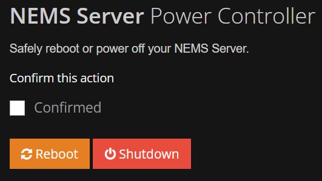
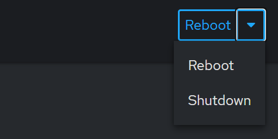

Reboot or Power Off NEMS Server
###############################

NEMS Linux 1.7 or Newer
***********************

NEMS Power Controller
=====================

NEMS Linux (since version 1.7) includes NEMS Power Controller.
From within NEMS Power Controller, you can safely reboot or power
off your NEMS Server. This is the preferred method on modern NEMS Servers
since it waits for NEMS tasks (such as updates) to complete before shutting
down.

You'll find NEMS Power Controller on the "System" menu.

Legacy Versions of NEMS Linux
*****************************

Cockpit
=======

On legacy NEMS Servers, login to Cockpit with Administrator access enabled
and look for the power options in the top right.

You'll find Cockpit on the "System" menu.
