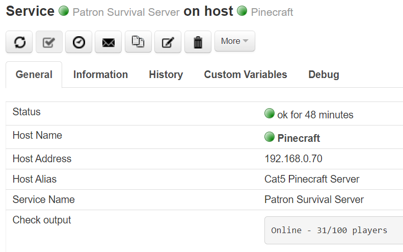

Check Command: check_minecraft
==============================

Check Minecraft server status, including whether up, down or full.
Also reports the server response time in milliseconds.

Need a Minecraft server? Create one for free and host it on a Raspberry Pi!
Download `Pinecraft Installer <https://github.com/Cat5TV/pinecraft/>`__ today!

Command Line
------------

`./check_minecraft -H [host_address] -P [game_port]`
