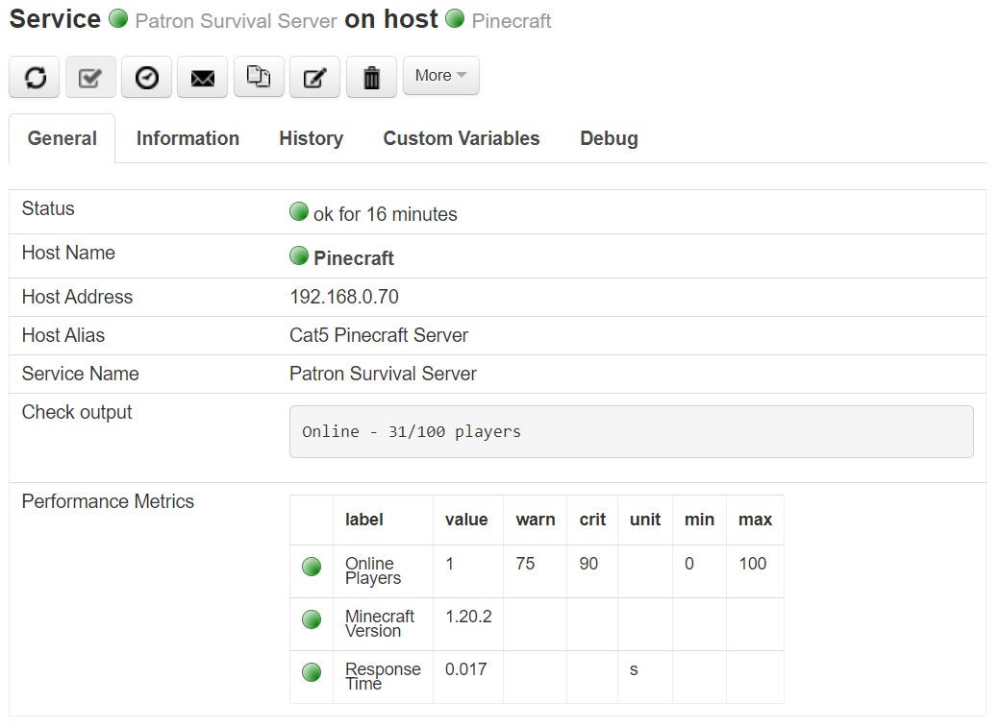

Check Command: check_minecraft
==============================

`check_minecraft` provides the current state of the Minecraft server (Online,
Down or Full), and also provides the following performance data:

- `Online Players` provides the current count of online players, plus the
  server maximum. A warning threshold is automatically set when the server
  reaches 75% of its set limits, and a critical threshold is met when 90%
  of the allowed players are connected.
- `Minecraft Version` informs you of the version of the running Minecraft
  server.
- `Response Time` tells you, in milliseconds, how long the Minecraft server
  is taking to respond.

`check_minecraft` will first try to connect to your Minecraft server using
a modern (>= 1.7) connection. If it fails to connect, it will then try using
a legacy (<= 1.6) connection. If it fails then, the server is considered
offline. This method allows NEMS Linux to check any version of Minecraft
without your having to specify the version manually and remembering to update
your check command every time you upgrade Minecraft.

Get Your Own Minecraft Server
-----------------------------

Need a Minecraft server? Create one for free and host it on a Raspberry Pi!
Download `Pinecraft Installer <https://github.com/Cat5TV/pinecraft/>`__ today!

`check_minecraft` is compatible with all versions of Pinecraft Installer-powered
Minecraft servers (as well as most other Minecraft, Paper, Spigot, Forge, etc.
servers).

Command Line
------------

`./check_minecraft -H [host_address] -P [game_port]`
