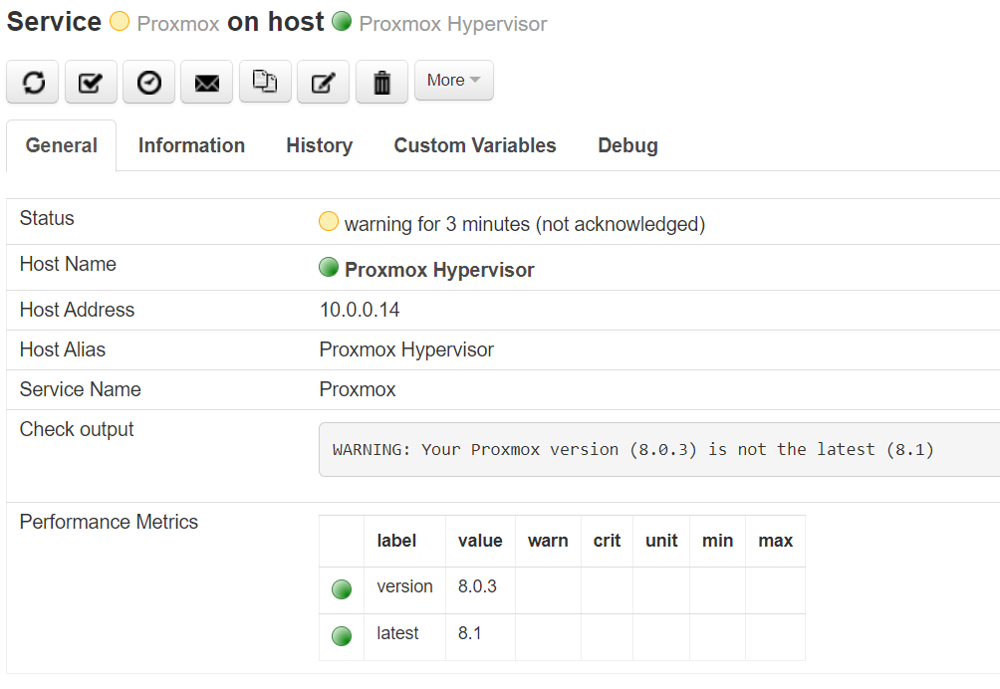

Check Proxmox Virtual Environment (check_pve)
=============================================

Monitor your Proxmox VE nodes with individual service checks for hypervisor CPU load, root
filesystem usage on the PVE node, Proxmox VE version, memory usage and swap usage).

Usage
-----

Check Command
~~~~~~~~~~~~~

*check_pve* is part of NEMS Linux 1.7+.

Usage
~~~~~

Check Command Arguments
~~~~~~~~~~~~~~~~~~~~~~~

- ``ip``: IP address of the Proxmox server [Required]
- ``port``: Port number Proxmox is accessible on (default: 8006)
- ``node``: The name of the node you wish to check [Required]
- ``username``: Username of user with PVEAuditor permission set [Required]
- ``password``: Password for that user [Required]
- ``realm``: Authentication realm (Eg., pve or pam) [Required]
- ``check``: Specify the check to perform (load, rootfs, version, memory, swap) [Required]
- ``warn``: Warning threshold [int] percentage (default: 80)
- ``crit``: Critical threshold [int] percentage (default: 95)

Configuration
~~~~~~~~~~~~~

#. On Proxmox VE, create a new user for NEMS Linux to use for the API. Give that user **PVEAudit** permissions.
#. In NEMS NConf
  #. create a host entry for your Proxmox VE server.
  #. Add the `check_pve` service to that host, setting the arguments appropriately for your environment.
  #. Generate your NEMS config.

.. Warning:: Never use your Proxmox VE root user or any user with more than **PVEAudit** permissions for monitoring.

CLI Example
~~~~~~~~~~~

.. code-block:: console

  ./check_pve ip=10.0.0.5 port=8006 node=myserver username=auditor password=Str0ngP4ssw0rd realm=pve check=load warn=80 crit=95
