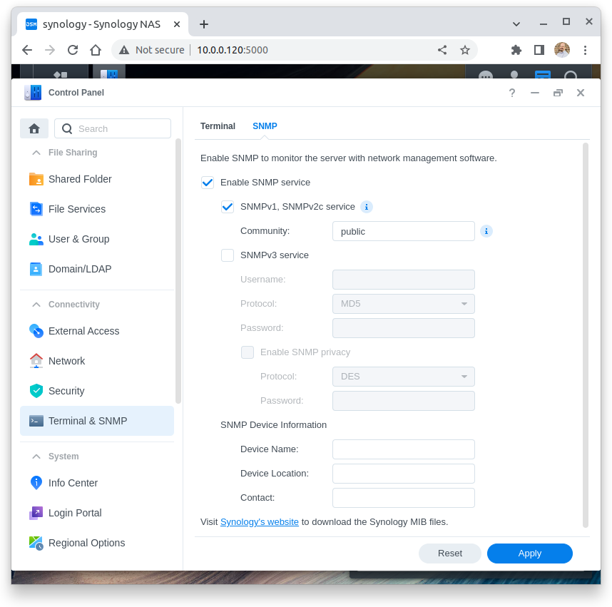

Check Commands: check_synology
==============================

Synology NAS monitoring is included in `NEMS Linux <https://nemslinux.com/>`__ 1.6 or later.

.. figure:: ../img/synology-nas-800.png
  :align: center
  :alt: Synology NAS Devices

Description
-----------

This check uses SNMP to check the state of a Synology NAS.

You will see any problems displayed on your NEMS Tactical Overview, NEMS Mobile UI, NEMS TV Dashboard, NEMS Adagios, or whichever tool you prefer for monitoring your network state with NEMS Linux. You'll receive an email, SMS, Telegram, Webhook or other notification (whichever you have configured on your NEMS Server) if a drive fails. Your `NEMS Warning Light </en/latest/nems-tools/warninglight.html>`__ will even turn red if there is a problem with your Synology NAS.

Assigning your Synology NAS host to the ``Synology`` Host Group in NEMS Configurator adds the following sample Advanced Services:

- Synology Disks
- Synology Fans
- Synology Power
- Synology RAID
- Synology System
- Synology UPS
- Synology Version

By default, the *admins* contact group will be notified.

The sample Advanced Services provided in NEMS Linux assume the community name to use is `public`.

Basic Usage
-----------
  
In Synology DSM
^^^^^^^^^^^^^^^

- Visit Control Panel -> Terminal & SNMP -> SNMP
- Check *Enable SNMP Service*
- Check *SNMPv1, SNMPv2c service*
- Ensure your Community name is set to *public*
- You do not need to enable *SNMPv3 service* nor *SNMP Privacy* since we are using the *public* community.
- Press **Apply**

In NEMS Configurator
^^^^^^^^^^^^^^^^^^^^

- On the left menu, click **Add** next to **Hosts**
- Enter a hostname for you recognize the device. *Synology* or *Synology NAS* are good examples.
- Under **Address** enter the local IP address of your Synology device.
- Leave **OS** set to Linux.
- Set *monitored by* to **Default Nagios**
- Set **max check attempts** to a reasonable number of attempts, such as 10.
- Set *assign host to hostgroup* to **Synology** (Highlight it and press the single green arrow to add it to the right column).
- Click **submit**.

This next step is currently required the first time you setup your Synology NAS. In a future release of NEMS Linux, we will include new defaults to remove this requirement, but for now, you must set your defaults:

- Click **Show** next to **Advanced Services**.
- Click the edit pencil icon next to **Synology Disks**.
- Set **max check attempts** to a reasonable number of attempts, such as 10.
- Press **Submit**.
- Repeat these steps for each of the Synology Advanced Services until all have a default **max check attempts** 

At this point, you may click **Generate NEMS Config** to activate your new Synology checks.

Reporting
^^^^^^^^^

.. figure:: ../img/synology-adagios-checks.png
  :align: center
  :alt: Synology checks displayed in NEMS Adagios
  
  NEMS Adagios displaying an overview of all Synology Advanced Services in the OK state.

Congratulations! NEMS Linux is now proactively monitoring your Synology NAS device.
  

Compatibility
-------------

Tested with the following versions of Synology DiskStation Manager:

- DSM 6.2.2-24922 Update 4
- DSM 7.0-41890
- DSM 7.1.1-42962 Update 4

This isn't to say you must run one of these versions. Rather, these are simply the versions we have tested with successfully. It can be assumed that the Synology checks built-in to NEMS Linux will also work with other point releases of DSM.

Source
------

``check_synology`` uses `check_snmp_synology <https://github.com/corben2/check_snmp_synology>`__.
