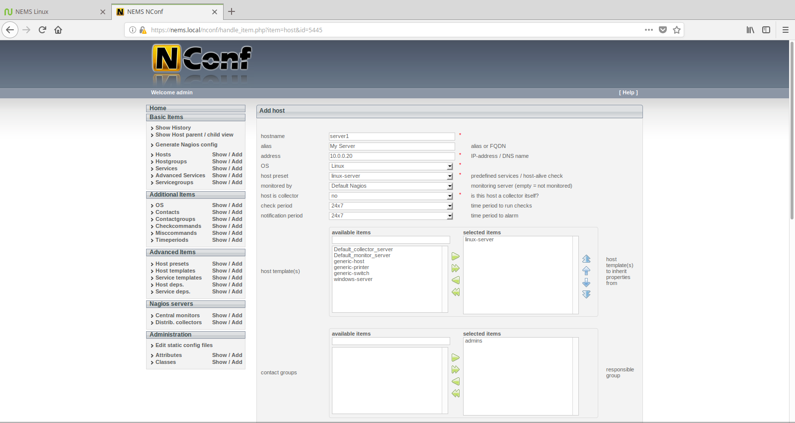
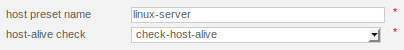
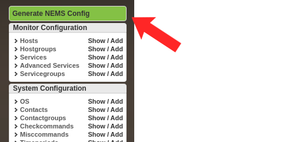

Monitoring a Linux Computer on Your Network
===========================================

Let's jump right into our first exercise as we learn to configure NEMS Linux to monitor a local Linux server’s uptime. I will demonstrate how some of the features of NEMS Configurator (NConf) are interconnected, and will prepare you for adding IP-based hosts to your NEMS server.

A “Host” in NEMS Linux is any device you wish to monitor. This can be a computer, or a thermostat; it can be a router or a printer. The options are truly endless, and while NEMS Linux is free to download and use, there are no software-based limitations on how many hosts you can have set up. A single NEMS Server can easily handle over 100 hosts.

Adding a Host
-------------

Adding a host for monitoring within NEMS is done through the NEMS Configurator (NConf) user interface. You’ll find this tool on the Configuration menu of your NEMS Dashboard. Within NConf, click the “Add” link next to “Hosts” on the left navigation. This will present you with the Add Host screen.

  
  Add a host to NEMS Linux using the NEMS Configuraton

As illustrated, enter the hostname--a friendly alias for your own reference as well as the IP Address of the host. As a side note, you’ll want to make sure your hosts have static IP addresses so they don’t change. Personally, I prefer to add DHCP reservations to my router rather than manually assigning the IP on the device. This keeps things simple and make it easier to ensure devices on my LAN always receive the same IP address, and that I don’t accidentally assign the same IP to two devices.

Next, in the OS drop-down on the same screen, select your host’s operating system. Note that if you don’t see an appropriate type, you may also add operating systems under “Additional Items” in the left navigation menu. However, for our example we’ll be adding our Linux server. “linux- server” is an out-of-the-box preset, so we will choose that. Refer to Figure 1.

A “Host Preset” allows you to add checks that are always used for this type of host. To help us understand what this is actually doing, let us digress for a moment and take a look under the hood. You can see what checks are going to be automatically applied via the selected Host Preset by pressing the “Show” link next to “Host Presets” on the left navigation menu.

  
  linux-server Host Preset

Realizing that the linux-server Host Preset initiates the check_host_alive check command, we can review what that actually does by clicking the “Show” link next to “Misccommands.”

.. figure:: ../../img/check_host_alive-check-command-details.png
  :width: 600
  :align: center
  :alt: check_host_alive details
  
  check_host_alive check command details

It’s running check_ping--a Nagios check command to simply ping the IP address we provide. The nice thing is, you didn’t even have to script that (refer to this statement from Part 1: “[NEMS] does away with the old Nagios scripting requirement”). I wanted to show you how it works, but as you’re just getting started with NEMS Linux, you will just select linux-servers and carry on, knowing that this will initiate a ping on that host (based on this example).

Next, we need to change “Monitored By” to the only option available: Default Nagios. That is the preconfigured Nagios Core instance running on your NEMS Linux server.

Host Template != Host Preset
----------------------------

A Host Template differs from a Host Preset in that it tells NEMS how we want our Host Preset to be performed: the monitoring schedule, the alert thresholds, and so-on. Based on the included linux-server Host Template, our linux-server Host Preset will check if the host is alive by pinging it every 10 minutes, and will send notifications during working hours if there is a problem. These defaults can always be changed by editing the Host Template. Of course, you can create your own presets and templates as you learn to use the system, though I recommend starting with the samples until you have a few hosts working.

In the Host Templates section of our Add Host screen, we’ll highlight linux-server and press the right arrow icon to move it to the “Selected Items” list as shown in Figure 1.

The only other item we must add to our host is who to contact if it is having problems. If we don’t specify this, no notifications will ever be received. By default, there is only one option, Admins. Highlight Admins and press the green arrow icon to move it to the Selected Items list. Refer again to Figure 1.

Because we are using the Host Template, we do not need to specify our check or notification intervals: they are specified within the Host Template. If you were not using a Host Template, you’d need to specify those values here. Because we are using a Host Template which carries these values, we can just save the new host by pressing “Submit.”

On the next screen, you will be given the opportunity to add more service checks to this host, but for the sake of our example and because we are using Host Presets and Templates, we can skip this part.

.. Tip:: In some cases, you may desire that your host checks occur at different intervals than are specified within the Host Template. For example, you may wish your mission critical server to be pinged every minute rather than every 10 minutes. In these cases, rather than editing the Host Template (and thereby impacting all hosts which use that template) you can specify unique values on the Add Host screen, which will override the Host Template values for this host.

Generate Nagios Config: Make Your Changes Live (In Review)
----------------------------------------------------------

To make your changes live and begin monitoring your new host, press the Generate Nagios Config link on the left navigation. You should see 0 errors. If you do see errors, press the syntax check bar and review where you went wrong. NConf is very good at showing you where to find the error is so you can go back and fix it.

  
  Generate Nagios Config with the NEMS Configurator

If everything checks out, press “Deploy,” and your new host will instantly be activated in Nagios.
