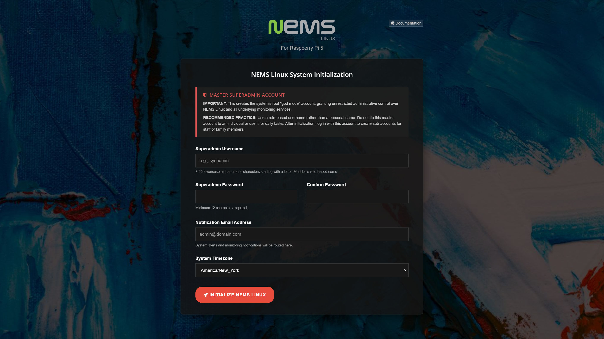

Initialization
==============

The NEMS Initialization screen greets you the first time you point your browser at your new NEMS Server.

  NEMS Initilization screen.

This task works magic under the hood in automatically configuring your entire server in just a few seconds. It creates and configures your superadmin account, enables all services and takes you to the NEMS Dashboard.

To access your NEMS Server, visit https://nems.local/ on the same network. Alternatively you can visit the Server's IP address, which you can obtain from your DHCP pool or from the console output of your appliance.

Once your NEMS Server is initialized, login as your superadmin user and then visit Configuration -> User Manager to assign a normal Admin user for day-to-day use.
