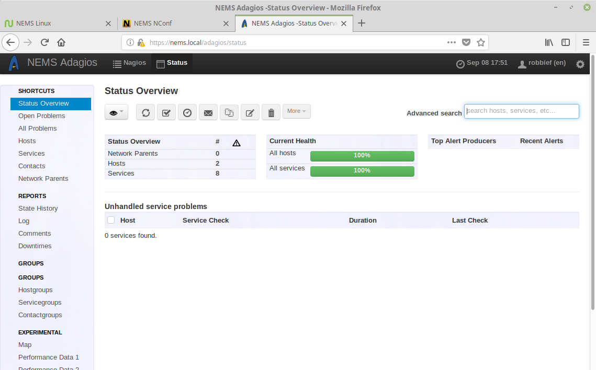
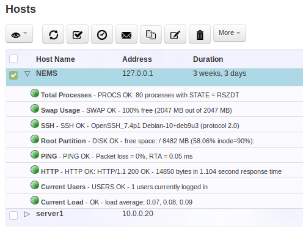
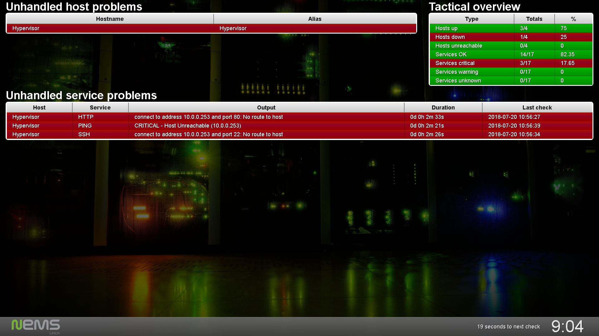

Monitoring Your Assets
======================

Introducing Adagios
-------------------

Now that we’ve configured our first host, let’s see how to check its status. There are several ways to keep tabs on your assets with NEMS Linux. For the Nagios purists, Nagios Core is included on the Reporting menu. But we've included something much more modern: Adagios. This, too, is found on the Reporting menu. Adagios offers the same overall functionality of Nagios Core’s front-end but replaces it with a modern, responsive bootstrap web interface.

  Adagios responsive interface

To check the status of our hosts, simply click “Hosts” on the left navigation.

.. figure:: ../img/Adagios-hosts-view.png
  :width: 600
  :align: center
  :alt: Adagios hosts view
  
  Adagios hosts view.

You’ll see the host `we added previously <./add_first_host.html>`__ (server1) is showing with the status of UP. This means the ping replied. There is no Service Status, since we did not add any extra service monitors. To see an example of what is possible, expand the NEMS host (which is included on your NEMS Linux server) by clicking the triangle next to its name.

  
  Expanded view of Host reveals configured service checks.

Problem Acknowledgement
-----------------------

In the case of a problem, you can open the host or service experiencing the problem to see more information, and even acknowledge the issue so you don't continue receiving notifications.

Other Ways to Monitor Your Assets
---------------------------------

I would also like to encourage you to test `NEMS Mobile UI <../apps/mobile.html>`__, `NEMS TV Dashboard <../apps/nems-tv.html>`__ and `NEMS Tactical Overview <../apps/tactical_overview.html>`__, all of which are also found on the Reporting menu of the NEMS Dashboard. The first is meant to offer you a complete mobile interface for monitoring your assets, and the latter two allow you to set up a TV display in your server room that shows a real-time tactical overview of your NEMS host and service checks.

  
  NEMS TV Dashboard circa NEMS Linux 1.4.1.
