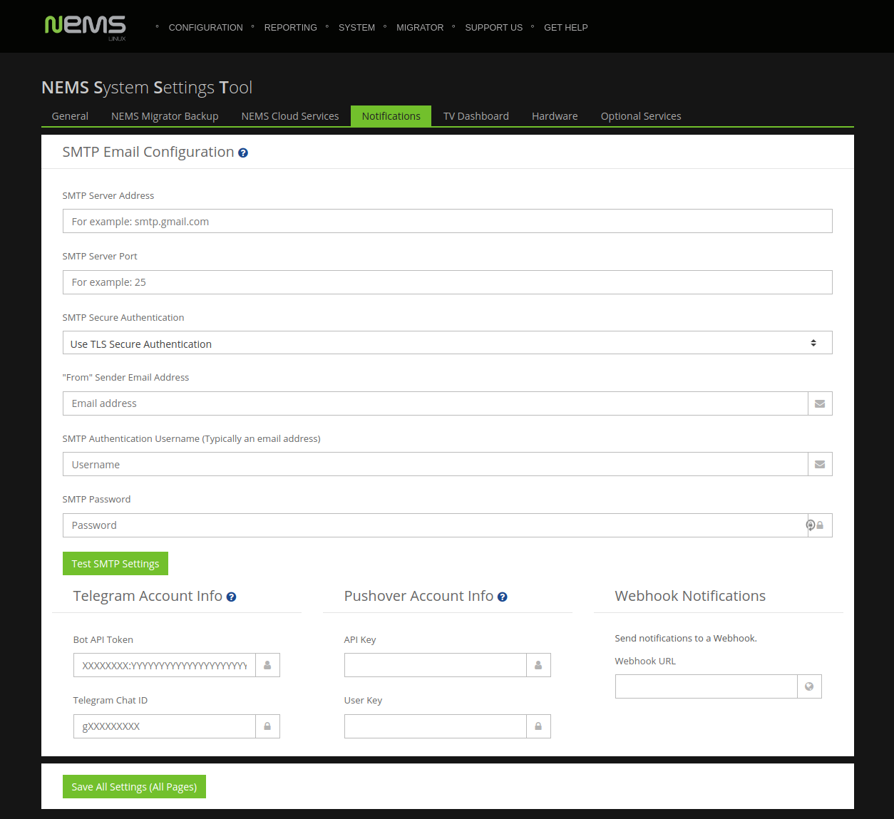

Configuring SMTP for NEMS Email Notifications
=============================================

Introduction
------------

The first thing you’ll want to do on your new NEMS Linux server is configure your SMTP settings. This will allow your NEMS server to email you if a problem is detected.

Access the NEMS System Settings Tool (SST) from the Configuration menu of your NEMS dashboard. This browser-based tool eliminates the need to use the traditional Nagios `resource.cfg` file to configure your email and other settings.

One of the nice things about NEMS Linux is that I really don’t have to go into detail about how to do this. It is so intuitive that it does not require explanation. So I’ll just provide a screenshot:

  Configuring your SMTP server in NEMS is as simple as configuring a mail client.

.. Tip:: If you’re using Gmail as your SMTP provider, be sure to review `the additional steps required <../config/smtp_config_gmail.html>`__.

Test Email Notification Settings
--------------------------------

.. note:: If you're using NEMS Linux 1.5.x or lower, the button does not exist in NEMS SST. Instead, open a terminal on your NEMS Server and type: ``sudo nems-mailtest <recipient_email>``

NEMS Linux features an easy-to-use tool which will load your SMTP
settings as entered in NEMS SST and send you a test email. It will
also show you the results of the attempt, which may be helpful if you
experience an error.

Once you've added your SMTP server settings in NEMS SST, simply press the
*Test SMTP Settings* button.

.. raw:: html

   <iframe width="560" height="315" src="https://www.youtube.com/embed/bWj3m6pB8RA" frameborder="0" allow="accelerometer; autoplay; clipboard-write; encrypted-media; gyroscope; picture-in-picture" allowfullscreen></iframe>

Save Your Settings
------------------

Once you are confident your SMTP settings are correctly entered, click **Save All Settings (All Pages)**.
