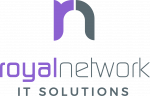

Welcome to NEMS Linux
=====================

Introduction
------------

NEMS Linux documentation, work in progress.

.. toctree::
    :maxdepth: 2
    :caption: Getting Started Guide

    gettingstarted/introduction
    gettingstarted/install
    gettingstarted/initialization
    gettingstarted/connect
    gettingstarted/smtp
    gettingstarted/generate_config
    gettingstarted/add_first_host
    gettingstarted/monitor_assets
    gettingstarted/notification_definitions
    gettingstarted/exercises

.. toctree::
    :maxdepth: 1
    :caption: Applications

    apps/cockpit

.. toctree::
    :maxdepth: 2
    :caption: NEMS Cloud Services

    nems-cloud-services/checkin

.. toctree::
    :maxdepth: 1
    :caption: Changelogs
    
    changelogs/1.6
    
.. toctree::
    :maxdepth: 1
    :caption: Credits

    credits
    
Important Links
---------------

- Support the project: https://patreon.com/nems/
- Web site: https://nemslinux.com/

Contribute to Documentation
---------------------------

- Source Code: https://github.com/cat5tv/nems-docs/

Corporate Sponsors
------------------

.. image:: ../img/sponsor_logos/cat5tv_network_dark.png
    :width: 200px
    :margins: 10px
    :alt: Category5 TV Network
    :target: https://category5.tv/

Patrons
-------

I'd like to thank all of our Patrons for your continued support of NEMS Linux development.

Here is a list of those Patrons who kicked in that little bit extra to have their name included in the changlogs:

* Patrick Kersten
* Marc Dörseln
* Dave Harman
* Bill Marshall
* Aaron Tringle
* Steve Hudnall
* IT Cyber Solutions
* Natacha Norman
* David Klindt
* Wolfgang Friedl
* Jeff Conaway
* Don Jenkins
* Marco Antonini
* Jessica K. Litwin
* Matthew Mattox
* Premium | Fischer-ICT
* Steve Thompson
* Jiffy
* Larry Getz
* Coquille Indian Tribe
* Jarrod Andrews
* Dennis Bailey
* Brian Darnell
* SystemOfADL
* Tony Browne
* Steven Beukes

Want your name on this list? `Become a Patron <https://patreon.com/nems>`__.

Contribute to Project
---------------------

nems-admin

- Issue Tracker: https://github.com/cat5tv/nems-admin/issues/
- Source Code: https://github.com/cat5tv/nems-admin/

nems-migrator

- Issue Tracker: https://github.com/cat5tv/nems-migrator/issues/
- Source Code: https://github.com/cat5tv/nems-migrator/

nems-scripts

- Issue Tracker: https://github.com/cat5tv/nems-scripts/issues/
- Source Code: https://github.com/cat5tv/nems-scripts/

nems-tools

- Issue Tracker: https://github.com/cat5tv/nems-tools/issues/
- Source Code: https://github.com/cat5tv/nems-tools/

nems-www

- Issue Tracker: https://github.com/cat5tv/nems-www/issues/
- Source Code: https://github.com/cat5tv/nems-www/

nems-tv

- Issue Tracker: https://github.com/cat5tv/nems-tv/issues/
- Source Code: https://github.com/cat5tv/nems-tv/

nconf

- Issue Tracker: https://github.com/cat5tv/nconf/issues/
- Source Code: https://github.com/cat5tv/nconf/

nems-wmic

- Issue Tracker: https://github.com/cat5tv/nems-wmic/issues/
- Source Code: https://github.com/cat5tv/nems-wmic/

Support
-------

If you are having issues, please let me know.

License
-------

GNU AGPLv3 https://www.gnu.org/licenses/agpl-3.0.en.html

Indices and tables
==================

* :ref:`genindex`
* :ref:`modindex`
* :ref:`search`
