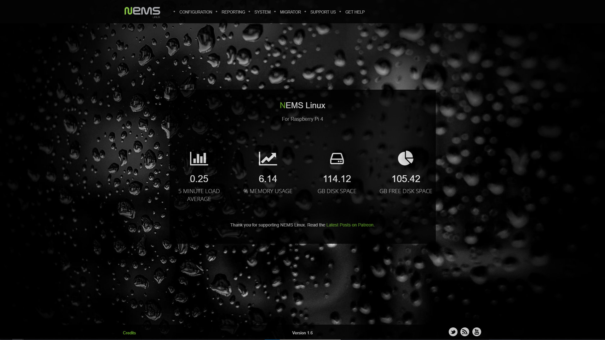

Welcome to NEMS Linux
=====================

+---------------+
| |Screenshot|  |
+---------------+

.. image:: https://readthedocs.org/projects/nemslinux/badge/?version=latest
  :target: https://docs.nemslinux.com/en/latest/?badge=latest
  :alt: Documentation Status

Preface
------------

The NEMS Linux documentation is a work in progress, and we are constantly
updating it. If you find any problems or inconsistencies, please either
provide a pull request on GitHub, file an issue on GitHub, or contact us
on Discord.

NEMS Linux Getting Started Guide
--------------------------------

Introduction
^^^^^^^^^^^^

The NEMS Linux Getting Started Guide is an introductory course in
understanding and using NEMS Linux. From the principles that drive
the project, to understanding how the various components work together.

By following this easy to understand guide, you will gain the
fundamental knowledge and skills required to use NEMS Linux effectively.

This guide is a primer and not comprehensive or even overly technical.
It is intended as an introduction to NEMS Linux for new users, or
those who wish to better understand how to use NEMS Linux at an
entry level.

Table of Contents
^^^^^^^^^^^^^^^^^

.. toctree::
    :maxdepth: 2
    :caption: Getting Started Guide

    gettingstarted/introduction
    gettingstarted/install
    gettingstarted/initialization
    gettingstarted/connect
    gettingstarted/smtp
    gettingstarted/add_first_host
    gettingstarted/generate_config
    gettingstarted/monitor_assets
    gettingstarted/notification_definitions
    gettingstarted/exercises

Conclusion
^^^^^^^^^^

Having gone through each page of the Getting Started Guide, you now have
a good foundation and are ready to use NEMS Linux in a production environment.

What's Next
^^^^^^^^^^^

- `Become a Patron <https://patreon.com/nems>`__ for additional perks and to support this project
- `Join the Discord <https://discord.gg/e9xT9mh>`__ to chat with other NEMS Linux users
- Keep reading the documentation below to learn more about how this feature rich appliance works
- `Visit the Community Forum <https://forum.nemslinux.com/>`__ to bounce ideas around
- Tell everyone you know about NEMS Linux, blog about it, screencast on your YouTube channel, talk about it on your podcast. Spread the word.

Documentation
-------------

.. toctree::
    :maxdepth: 1
    :caption: The Basics

    basic/default_password
    check_commands/index
    basic/backupnems
    basic/nav
    basic/9590
    basic/connect_via_ssh
    basic/faq
    apps/nems-migrator

.. toctree::
    :maxdepth: 2
    :caption: Platforms

    platforms/index

.. toctree::
    :maxdepth: 1
    :caption: nems-tools Components

    nems-tools/gpioextender
    nems-tools/nemseos
    nems-tools/nems-hero
    nems-tools/warninglight

.. toctree::
    :maxdepth: 2
    :caption: Notifications

    notifications/index

.. toctree::
    :maxdepth: 2
    :caption: NEMS Commands

    commands/index

.. toctree::
    :maxdepth: 1
    :caption: Configuration

    config/networking
    config/smtp_config_gmail
    config/smtp_config_outlook

.. toctree::
    :maxdepth: 1
    :caption: Applications

    apps/serveroverview
    apps/nems-sst
    apps/nconf
    apps/adagios
    apps/mobile
    apps/nems-tv
    apps/tactical_overview
    apps/monitorix
    apps/cockpit
    apps/monitservicemonitor

.. toctree::
    :maxdepth: 3
    :caption: NEMS Cloud Services

    nems-cloud-services/index

.. toctree::
    :maxdepth: 2
    :caption: Monitoring Specific Platforms

    check_commands/usage/microsoft-windows/index
    check_commands/usage/linux/index

.. toctree::
    :maxdepth: 1
    :caption: Advanced Configuration

    advanced/nemsupgrade
    advanced/legacyupgrade
    advanced/snmp
    advanced/mrtg
    advanced/nemsicons
    advanced/nems-api

.. toctree::
    :maxdepth: 2
    :caption: Hardware

    accessories/index
  
.. toctree::
    :maxdepth: 3
    :caption: Changelogs
    
    changelogs/index-nems
    changelogs/index-nemseos

.. toctree::
    :maxdepth: 1
    :caption: Upcoming Features

    advanced/nems-mesh

.. toctree::
    :maxdepth: 1
    :caption: To-Do List and Report Bugs

    todolist/todolist
    todolist/reportissues
  
.. toctree::
    :maxdepth: 1
    :caption: Miscellaneous

    misc/self-signed-certificates
    misc/backupnemsfile
    misc/nemszram
    misc/nemslicensing
    misc/nemsbranding
    misc/anonymousstats
    misc/nemslinux-sourcecode
    misc/md5checksums
    misc/vendorbranding

.. toctree::
    :maxdepth: 1
    :caption: Troubleshooting

    troubleshooting/multicast_name_resolution
     
.. toctree::
    :maxdepth: 1
    :caption: Credits

    credits
    
.. toctree::
    :maxdepth: 1
    :caption: NEMS SaaS

    nems-saas/index
    
    
Important Links
---------------

- Support the project: https://patreon.com/nems/
- Web site: https://nemslinux.com/

Contribute to Documentation
---------------------------

- Source Code: https://github.com/NEMSLinux/nems-docs/

Support
-------

As NEMS Linux continues to grow, our support options are also evolving. At present, there are a few key points to keep in mind when seeking support:

#. NEMS Linux is a community-driven project, so the best place to start is usually the community. We offer an `official Discord server <https://discord.gg/e9xT9mh>`__ and a `Community Forum <https://forum.nemslinux.com>`__ to help you find what you need.
#. Our lead developer, Robbie Ferguson (*RobbieF#7136*), is often available via our Discord server. That is the best place to reach him directly.
#. Among other perks, users who choose to `support NEMS Linux on Patreon <https://patreon.com/nems>`__ gain access to Patron-exclusive rooms on our Discord server, including #priority-support, which are setup to ding lead developer, Robbie Ferguson, on his phone. So in cases where priority support is required, he's usually quite good to reply promptly.

Credits
-------

Please see the
`NEMS Linux Credits page <https://nemslinux.com/credits/>`__.

Patrons
-------

I'd like to thank all of our Patrons for your continued support of NEMS Linux development.

Here is a list of those Patrons who kicked in that little bit extra to have their name included in the changlogs:

https://raw.githubusercontent.com/NEMSLinux/nems-www/main/debpack/var/www/html/credits/credits.txt
   
Want your name on this list? `Become a Patron <https://patreon.com/nems>`__.

**A Product Of**

+----------+
| |CAT5TV| |
+----------+

NEMS Linux is developed by Robbie Ferguson for `The Category5 TV Network <https://category5.tv>`__.

License
-------

NEMS Linux and the code written specifically for it are
licensed under GNU AGPLv3:
https://www.gnu.org/licenses/agpl-3.0.en.html

Third-party products or features included within NEMS Linux
may have their own license. Please review their
project pages for more information.

Background wallpaper contained in NEMS Linux are
licensed under CC0.
