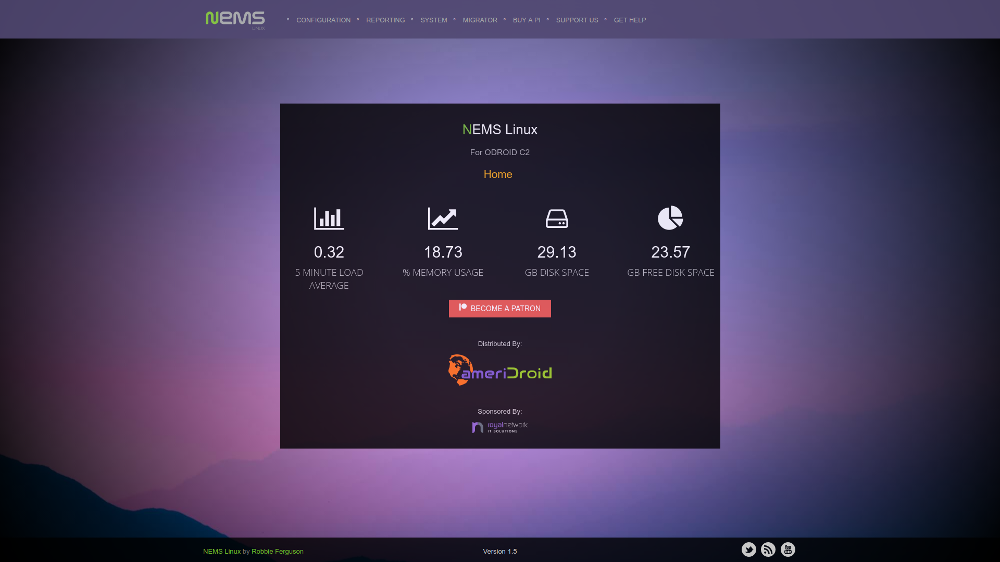

NEMS Linux Vendor Branding
==========================

Whether you're a vendor, distributor or IT professional, it's
nice to include your own branding if you install a NEMS Server at a
client site, or if you're building and selling NEMS Linux appliances.

Currently the NEMS Linux Vendor Branding feature supports:

1. Vendor Logo
2. Vendor  (optional)
3. Vendor License (optional)

When you add your vendor logo, it will be scaled to a maximum height of
60 pixels and placed on the NEMS Dashboard above sponsor logos, and the
sponsor logos will be shrunk to a smaller size. If you include a , the
logo will be clickable and will open a new tab to your  when clicked.

Add Your Vendor Branding
------------------------

**Tip:** When creating your vendor image master, do not boot the image.
Instead, add your vendor files using a card reader on a computer, and
then create an img of the card containing your vendor files. If you boot
the system from your card, the filesystem will be resized to fill the
card, so your resulting img will be huge. You may then have trouble
re-imaging it to new cards since the capacity from card to card may vary
by a byte or two.

1. Mount your NEMS Linux drive (Eg., SD card) on your computer.
2. Place your logo in the *vendor* folder on the *boot* partition. It
   must be named **logo.png**
3. If you would like your logo to be clickable (eg., link to your
   company web site), create a file in that same folder
   called **url.txt** and paste your full  into the file.
4. A Vendor License may be purchased, if desired. If a valid Vendor
   License is included, all users who share this build will be able to
   utilize your NEMS Cloud Services account. This means you will be able
   to monitor every server that is distributed under your account. This
   feature is intended for IT administrators who need to monitor
   widespread networks.

Logo Tips
---------

-  Your logo should have a transparent background.
-  Your logo should scale nicely and be recognizable when it is scaled
   to 60 pixels high.
-  You should assume the logo will always be presented on a dark
   background. If your logo is dark, consider adding a light border to
   your logo.png file.
-  URLs need to be complete. For example, **nemslinux.com** is
   incorrect, whereas **https://nemslinux.com/** is correct.
-  Be mindful that you are placing your logo file within
   the *boot* partition, which is generally quite small. Ensure your
   file is of reasonable size, especially considering it will be scaled
   down to a height of 60 pixels. So a massive high-res logo.png is
   really unnecessary. If you run out of space on *boot* you could
   experience problems.