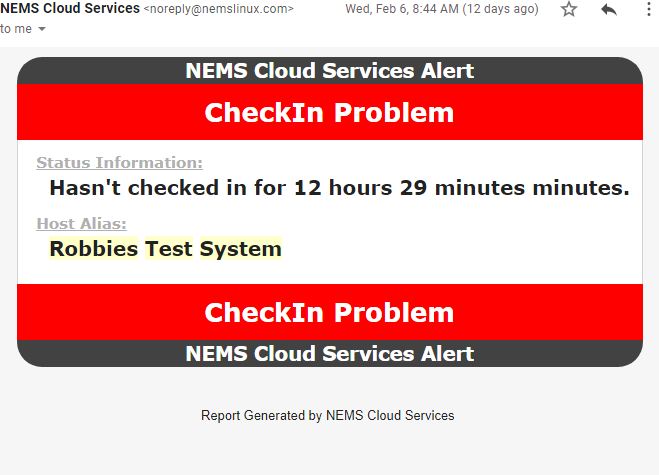

NEMS CheckIn
============

Introduction
------------

NEMS CheckIn is a feature of NEMS Cloud Services designed to address concerns that if a NEMS Server was to go offline, the admin would stop receiving notifications and may not realize this for some time. In early versions of NEMS Linux, this led to some users setting up multiple NEMS Servers--NEMS Servers to monitor NEMS Servers.

NEMS CheckIn is the answer to this. If enabled, NEMS CheckIn will tell the NEMS Cloud Services API that your NEMS server is online. If your NEMS server goes offline (stops reporting in), the NEMS Cloud Services server will send you an email letting you know it lost contact with your NEMS server.

Configuration
-------------

NEMS CheckIn can be enabled within NEMS System Settings Tool under NEMS Cloud Services. It is disabled by default.

.. figure:: ../../img/NEMS-SST-CheckIn.png
  :width: 600
  :align: center
  :alt: NEMS CheckIn Settings in NEMS SST

  Configuring NEMS CheckIn in NEMS SST is a breeze

Should the server not hear from your NEMS Linux server within a set time frame, an email will be sent to the email address you've specified in NEMS System Settings Tool, alerting you that your NEMS Server has failed to check in. It is a simple but highly effective solution.

A total of up to 5 notifications will be sent should your NEMS server fail to check in. Notices are sent at intervals of:

Notifications
-------------

The interval you choose in NEMS SST (Default is after your NEMS server has been offline for 2 hours)
After 6 hours of downtime.
After 24 hours of downtime.
After 48 hours of downtime.
Following recovery.

  A sample NEMS CheckIn notification

System Requirements
-------------------

NEMS CheckIn requires the following:

* An active NEMS Cloud Services account,
* NEMS Linux 1.5 or higher,
* A working recipient email account to send notifications to.

NEMS CheckIn does not require that you have a sending email service.
