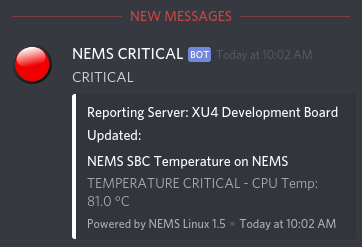

Notifications by Webhook
========================

Send notifications directly to your webhook. For example, have
your NEMS Linux server post alerts directly to your company Discord
channel.

To use NEMS Warning Light's webhook feature, simply add your
webhook  to `NEMS SST <https://docs.nemslinux.com/config/nems_sst>`__.

Webhook functionality requires NEMS Linux 1.5+. NEMS only sends
webhooks. It does not receive them.

Currently Supported Webhooks:
-----------------------------

-  Discord
-  Slack
-  Microsoft Office 365 / Teams

If you would like support added for another webhook, please simply put
it in as a feature request in the Community Forum.

Configuring Webhooks
--------------------

Microsoft Office 365 / Teams
~~~~~~~~~~~~~~~~~~~~~~~~~~~~

-  Sign in to `Microsoft Teams <https://teams.microsoft.com/>`__

Test Your Webhook
-----------------
.. code-block:: console

    sudo nems-webhooktest
