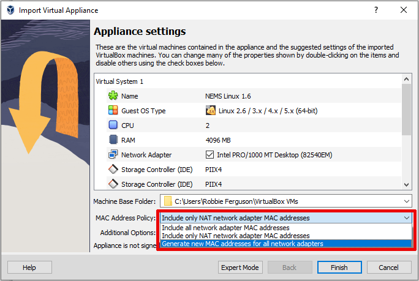

.. include:: ../global.rst

NEMS Linux Virtual Appliance
============================

The NEMS Linux Virtual Appliance however is a commercial build for business datacentres, and is only available on a subscription basis, or as a perk to those who `support NEMS Linux on Patreon <https://patreon.com/nems>`__. An active subscription is required in order to operate the Nagios Enterprise Monitoring Server Virtual Appliance. Your ongoing support helps fund the development of NEMS Linux. If you are looking to obtain NEMS Linux for free, please check out one of the popular releases for Single Board Computers instead.

The NEMS Linux virtual appliance has 3 available releases:

-  **NEMS OVA** (Open Virtual Appliance) can be easily deployed on
   virtualization hypervisors such as VMware ESXi, vSphere, Player or
   Workstation or Oracle VirtualBox. The OVA package contains the entire
   virtual appliance and is ready to import and boot.
-  **NEMS VHD** (Virtual Hard Disk) can be used to deploy NEMS Linux on
   Microsoft Hyper-V.
-  **NEMS QCOW2** (QEMU Copy-On-Write) can be used to deploy NEMS Linux
   on QEMU, KVM, Proxmox VE, and other hypervisors that support the
   QCOW2 format.

The underlying software in each release is identical. The individual
releases are created in order to ease deployment across a variety of the
most popular virtualization hypervisors.

.. Note:: All NEMS Virtual Appliance images are downloaded via BitTorrent. There is no other way to download the enterprise edition of NEMS Linux.

Host Requirements
-----------------

All Hypervisors
^^^^^^^^^^^^^^^

-  VT-x/AMD-V capable CPU with feature enabled in BIOS/UEFI
-  Minimum 6 GB free RAM
-  100 GB hard disk space

NEMS Linux uses Virtual Hardware Version 10 to ensure backward compatibility with legacy hypervisors.

VMware ESXi
^^^^^^^^^^^

NEMS Linux OVA has been built to work on ESXi version 5.5 or higher. 7.0+ recommended.

If deploying NEMS Linux on a legacy version of ESXi (such as ESXi 6.7) fails due to the virtual hard disk being thin-provisioned, you may extract the VMDK from the OVA file (rename the file ``.tar`` and open it with a tool such as ``tar`` or 7-zip) and use ``vmkfstools`` to expand the disk to thick provisioned. Please consider upgrading your hypervisor for official support. See: https://kb.vmware.com/s/article/1028943

Guest Specifications
--------------------

-  64-Bit
-  80 GB Virtual Hard Disk (Dynamic / Thin Provisioning where supported)
-  4 GB RAM

Global Deployment Notes
-----------------------

-  **Network Bridge** - Before booting, you must configure your virtual
   Network Interface to use your actual LAN in Bridged mode.
-  **Unique MAC Address** - While configuring your virtual Network
   Interface, you must generate a
   new MAC address for the virtual NIC. If your hypervisor does not
   offer a feature to automatically generate a MAC address you can
   visit `nemslinux.com/api/mac <https://nemslinux.com/api/mac>`__ to
   generate one. Do not simply enter random numbers. **Record your
   virtual MAC address somewhere safe.** Do not change your MAC address
   after initializing NEMS. Doing so would result in your HWID changing,
   which will disassociate your Virtual Appliance with NEMS Cloud
   Services.
-  **CPU Virtualization Features** - x86 Virtualization must be available
   and enabled on your physical CPU
   in order to boot the Virtual Appliance. This is found in your host
   machine's BIOS/UEFI settings and will be called VT-x (Intel) or AMD-V
   (AMD), or something similar such as “Virtualization Extensions”.
-  **Static RAM Mode** - Ensure RAM is :underline:`not` assigned as
   "dynamic" RAM. ESXi, for example, may
   remove all RAM from the appliance if set to dynamic, which will
   result in NEMS Linux not functioning correctly. RAM should be static.
-  **Hyper-V** - Choose Generation 1 under Specify Generation when creating VM.
-  Following initialization, you'll see a ``CPU Temperature`` check that reports an
   unknown state since your hypervisor doesn't report CPU Temperature data for
   virtual machines. You can remove this check in NEMS Configurator by going to
   `Advanced Services` [Show], Edit `CPU Temperature`, and remove `NEMS` from your
   assigned hosts. Save the change and generate your config.

Installation Procedures
-----------------------

VirtualBox
^^^^^^^^^^

**Minimum VirtualBox Version:** 7.0

When importing the NEMS Linux OVA, you must set the MAC Address Policy to "Generate new MAC address for all network adapters".

