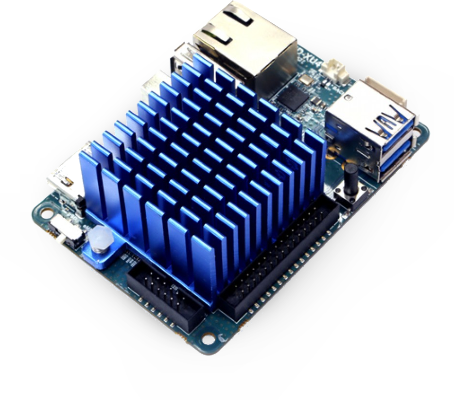

.. include:: ../global.rst

NEMS Linux on Single Board Computers
====================================

When choosing your hardware, general SBC comparisons are not necessarily
relevant since you will be deploying a NEMS Linux server specifically.
As an example, an ODROID-C2 vs Raspberry Pi 3 comparison will say
Raspberry Pi 3 has better support for video drivers. Well, that won't
matter to you; you're using NEMS Linux and we've pre-built the distro
for you, and nothing about it requires good video driver support.
So because of this, it is helpful to review `the NEMS Linux
Stats page <https://nemslinux.com/stats/>`__, and even `discuss it on our
Discord Server <https://discord.gg/e9xT9mh>`__ to make an educated
decision.

Here are some general guidelines.

1. eMMC storage is better than an SD Card. This is a universal truth. SD
   Cards have a high failure rate whereas eMMC tends to operate with
   perceptively similar reliability and performance to a traditional SSD.
   NEMS Linux performs
   a lot of read/write operations, as you can imagine, so the more
   reliable your storage medium, the more reliable your NEMS Server.
2. More RAM means better performance. The minimum recommended RAM is 1GB,
   though 2GB or higher will greatly improve performance and reliability
   of your NEMS Server.

Raspberry Pi
------------

.. figure:: ../img/raspberry_pi_3_b_plus.png
  :width: 500
  :align: center
  :alt: Raspberry Pi 3 B Plus

`BUY NOW <https://cat5.tv/pi/>`__

Pine64
------

.. figure:: ../img/pinea64-plus.png
  :width: 500
  :align: center
  :alt: Pine64 A64 Plus

Hardkernel ODROID XU4
---------------------

FriendlyElec
------------

.. figure:: ../img/nanopc-t4.png
  :width: 400
  :align: center
  :alt: NanoPC T4

Orange Pi
---------

.. figure:: ../img/orange-pi-3.png
  :width: 500
  :align: center
  :alt: Orange Pi 3

ASUS Tinker Board / S
---------------------

.. figure:: ../img/asus_tinker_board_s.png
  :width: 500
  :align: center
  :alt: Asus Tinkerboard S

ASUS Tinker Board S must be switched to Maskrom boot mode in order to
boot from SD card. The built-in eMMC is not big enough to run NEMS Linux
from.

Khadas VIM3
-----------

.. figure:: ../img/khadas_vim3_basic.png
  :width: 400
  :align: center
  :alt: Khadas VIM 3

You can boot from SD or USB, then install NEMS Linux to the integrated
eMMC storage by typing;

.. code-block:: console

    sudo nems-install

